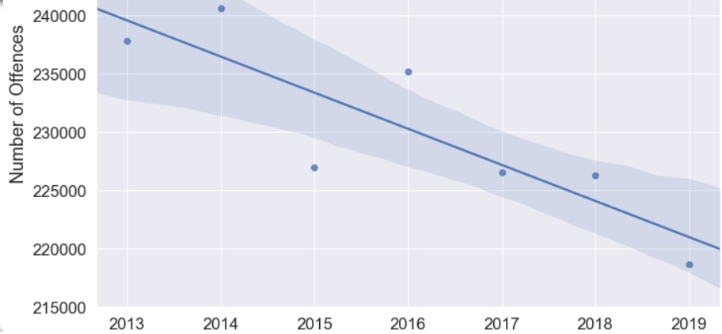
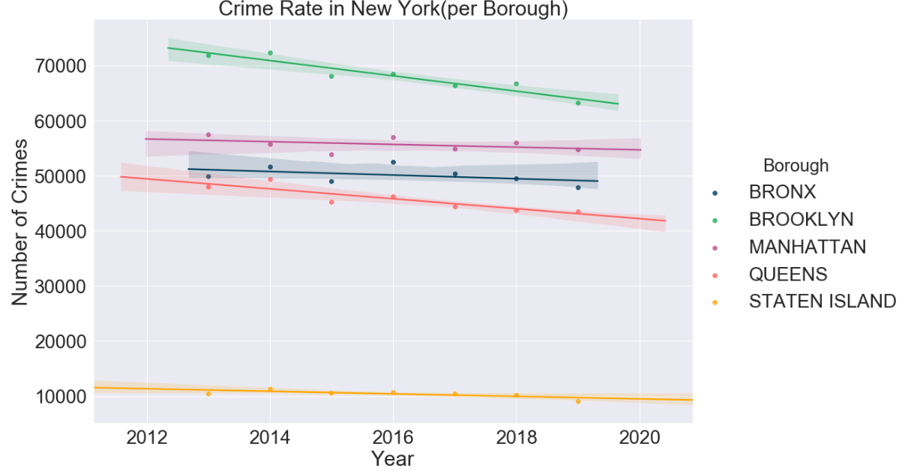

## Task  1: Identify one or more suitable web APIs

<strong><h3>New York Crime Data Analysis.</h3></strong>
* New York is the most popular city in United States of America(USA). It has a population of more than 8.5 million and it keeps growing. Being densely populated city has direct impact on crime rate. However, the crimes in city are unevenly distributed depending on various factors. Once known as the "murder capital", NYC crime, especially murder rates, has decreased in that last two decades. However, crime has not stopped, so it's important to know when, where, and what crimes are taking place. It is especially important to know what kind of crimes happen where. Thus, we're going to embark on an exploratory data analysis of crime complaints in NYC and make predictions about crimes in Brooklyn.

* New York has 5 administrative regions called Boroughs := `['The Bronx', 'Manhattan', 'Brooklyn', 'Queens', 'Staten Island']`
* <b>Objectives</b> - 
    * To understand crime rate in New York in the last 6 years (2013 - 2019).
    * What kind of crimes are most prevalent in New York?
    * Are there certain times when crime is more likely to occur? If so, when?
    * Find if there is any major difference in the regions of New York in crime rate.
    * Try to find associations / patterns in crime analysis with respect to another important criteria in New York.
    
* <b>Data Sources</b> -
    * The data for this analysis is taken from two sources namely - 
        - [NYPD Complaint Data Historic](https://data.cityofnewyork.us/Public-Safety/NYPD-Complaint-Data-Historic/qgea-i56i)
           : This dataset includes all valid felony, misdemeanor, and violation crimes reported to the New York City Police Department (NYPD) from 2006 to the end of 2017 
        - [NYPD Complaint Data Year To Date](https://data.cityofnewyork.us/Public-Safety/NYPD-Complaint-Data-Current-Year-To-Date-/5uac-w243)
           : This dataset includes all valid felony, misdemeanor, and violation crimes reported to the New York City Police Department (NYPD) for all complete quarters so far from 2018 to 2019
        
    * Both the datasets belong to the New York Crime Department. This dataset is publicly avaiable via the Socrata Open Data API. More about the Socrata Open Data API can be found [here](https://dev.socrata.com/)
    
* <b>Note on limitations</b> - 
    1. Historic data has been collected from 2013 to 2017. For each year 6 months data has been collected from January to June
    2. Year to Date data has been collected from 2018 to 2019. For each year 6 months data has been collected from January to June
    3. Manually change dates in the scraping utility to get data

## Task 2: Collect data from chosen API(s)

### Set default configuration variables that can be used globally

1. `setDefaults()` : acts as setter function that initialises global variables which can be referenced throughout the notebook 
2. `isValid()` : validation checks to check if the request parameters and other globals are passed correctly to the API  
3. `isValidAndSetDefaults()` : helper function for setDefaults() and isValid()

### Perform API Request and store the response in csv file

1. `getData()`: helper function to support the below operations  
    1.1 `buildURL()` : constructs URL from base URL and global vars_  
    1.2 `callAPI()` :  helper function that performs data fetch operation  
    1.3 `getDataByChunks()` : main function that builds the data by fetching it in chunks and dumping into the csv files  
2. `mergeCSV()`: merges the resultant csv files obtained from getData() to a single resultant csv file  

### Define entry-point helper function to call getData() on two API endpoints

1. `preprocessData()`: preprocesses data and returns two df respectively for historic and yearToDate  
    1.1 `preprocessHistoric()`:  preprocess data and returns df for historic data  
    1.2 `preprocessYearToDate()`:  preprocess data and returns df for yearToDate data  

<b>Note</b> - 

<b><i>To trigger this API call for 6 years, you have to manually change the dates in the `preprocessHistoric()` and `preprocessYearToDate()`</i></b>

* For `preprocessHistoric`, a sample setup for API request will be as:  

`def preprocessHistoric(dataURI):
        isValidAndSetDefaults(dataURI, <start_date_as_string>, <end_date_as_string>, "data") #This is the line that has to be modified
`

* For `preprocessYearToDate`, a sample setup for API request will be as:  

`def preprocessYearToDate(dataURI):
        isValidAndSetDefaults(dataURI, <start_date_as_string>, <end_date_as_string>, "data") #This is the line that has to be modified
`

<b><i>Also, there must be empty directories created with exact name as `data_Historic` and `data_YTD` in the same directory where this notebook exists to ensure that this code runs successfully. Without these directories, the user will not be able to send the API request</i></b>

## Task 4: Load and represent the data using an appropriate data structure. Apply any pre-processing steps to clean/filter/combine the data

### Preprocessing step 1 - Trim the columns that have NAN values > 50 %
Trimming attributes based on formula - sum(nan_counts_in_attribute) / len(attribute).

### Preprocessing step 2 - Fill the missing values and Rename columns
1. `fillMissingData()`: Fills missing values in key columns and performs further trimming of Nan values  
    1.1 `fillMissingComplaintDate()` : Helper to extract only 3 date columns  
    1.2 `fillNANsInComplaintDate()` :  Fill NAN values in the column `Complaint from date` from column `Complaint end date` / `Reporting date`.
    1.3 `reTrimAndRenameColumns()` : Trim more columns not required and rename columns to more meaningful  
    
<strong>Note</strong> - In Ideal scenarios the filed report date for a crime is usually <b><i>near</i></b> to the actual date when crime happened. Hence, reporting_date is dumped into the complaint_from_date where the actual complain date of crime is missing and complaint_end_date is missing.

### Preprocessing step 3 - Reduce memory, extract year, month and process dates.
1. `reduceMemory()`: Most of the column are not needed to be stored as they are. They can be transformed into categories  
2. `extractYearAndMonth()` : Extracts year and month from date column  
3. `processDates()` :  Fill NAN values in the column `Complaint from date` from column `Complaint end date` / `Reporting date`

<strong>Note</strong> - In Ideal scenarios the filed report date for a crime is usually <b><i>near</i></b> to the actual date when crime happened. Hence, reporting_date is dumped into the complaint_from_date where the actual complain date of crime is missing and complaint_end_date is missing.

## Task 5: Analyse and summarise the cleaned dataset

### Load cleaned dataset and form groups by year and boroughs for further analysis

The information about areas size of boroughs is given [here](https://en.wikipedia.org/wiki/Boroughs_of_New_York_City)

### Analysing crime rate per year in New York

</img>

 

Note - The blue dots represent the crime number and the line represents the crime rate  
<b>Inference</b> - 
1. There is a steady drop in crime rate from years 2013 - 2018. 
2. Approximately crime rate drops by roughly 7000 crimes per year.

### Analysing crime rate across boroughs in New York

</img>

 
